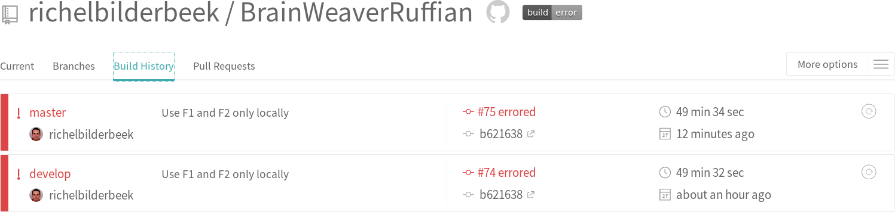

# BrainWeaverRuffian

Branch||
---|---|---
`master`| | 
`develop`| | 

QTest suite to test BrainWeaver by brute force.

The desired build status of BrainWeaverRuffian is this:

 

This build status means that Travis CI abouts the build as it takes too long.
This is a Good Thing, as this means that the rough testing of BrainWeaver
did not cause it to break.

Note that the code coverage of the Ruffian is unimportant. It's goal is to be rought to BrainWeaver in any way.